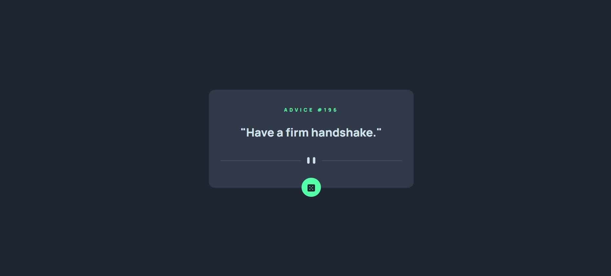

# Frontend Mentor - Advice generator app solution

This is a solution to the [Advice generator app challenge on Frontend Mentor](https://www.frontendmentor.io/challenges/advice-generator-app-QdUG-13db). Frontend Mentor challenges help you improve your coding skills by building realistic projects.

## Table of contents

- [Overview](#overview)
  - [The challenge](#the-challenge)
  - [Screenshot](#screenshot)
  - [Links](#links)
- [My process](#my-process)
  - [Built with](#built-with)
  - [What I learned](#what-i-learned)
  - [Continued development](#continued-development)
  - [Useful resources](#useful-resources)
- [Author](#author)
- [Acknowledgments](#acknowledgments)

**Note: Delete this note and update the table of contents based on what sections you keep.**

## Overview

### The challenge

Users should be able to:

- View the optimal layout for the app depending on their device's screen size
- See hover states for all interactive elements on the page
- Generate a new piece of advice by clicking the dice icon

### Screenshot




### Links

- Solution URL: [Add solution URL here](https://your-solution-url.com)
- Live Site URL: [Add live site URL here](https://your-live-site-url.com)

## My process

### Built with

- Semantic HTML5 markup
- CSS custom properties
- Flexbox
- CSS Grid
- Vanilla Javascript
- [Bootstrap v5.2](https://getbootstrap.com/docs/5.2/getting-started/introduction/)

### What I learned

Fetch API using Javascript:
```js
function getAdvice(){
  fetch("https://api.adviceslip.com/advice")
  .then((response) => response.json())
  .then((data) => {
    advice = data.slip.advice;
    id = data.slip.id;
    document.querySelector(".card-title").innerHTML = "ADVICE #" + id;
    document.querySelector(".card-text").innerHTML = '"' +  advice + '"';
  });
}
```

How to use flexbox in Bootstrap 5 for vertically center a `div`:

```html
<div class="d-flex align-items-center vh-100">
```

Make an item look like it is glowing by adding shadow:
```css
.btn:hover{
    background-color: hsl(150, 100%, 66%);
    box-shadow: 0 0 20px 2px hsl(150, 100%, 66%);    
}
```

### Useful resources

- [Stack Overflow](https://stackoverflow.com/questions/22196587/how-to-vertically-center-a-container-in-bootstrap) - This help me out with vertically centering a `div`
- [Fetch API - MDN Web Docs](https://developer.mozilla.org/en-US/docs/Web/API/Fetch_API/Using_Fetch) - Refer this for using Fetcg API with Javascript


## Author

- Frontend Mentor - [@hnvkhanh](https://www.frontendmentor.io/profile/hnvkhanh)


